# Automated SIEM Security Email Alerting using Microsoft Sentinel

M.Tech project (Cyber Security and Digital Forensics), VIT Bhopal University

| | |
|---|---|
| **Student** | Sandeep S Raghav (Regn. No. 25MCF10017) |
| **Supervisor** | Dr. Hariharasitaraman S, Associate Professor (Senior) |
| **School** | School of Computing Science Engineering and Artificial Intelligence, VIT Bhopal University |

## The problem

The base paper, *Intelligent-based SIEM security email alert* (Chi et al., ICoICT 2023), sends alert emails through a manual process. An analyst exports logs to an Excel file, uploads it, and fills in a form before an email goes out. This adds minutes of delay and needs a person at every step.

## This project's solution

The whole path from log to email is automatic. No analyst has to touch a file or a form.

```
Windows VM (events 4624, 4625, 4720)
   -> Azure Monitor Agent + Data Collection Rules
   -> Log Analytics workspace (Event, SecurityEvent tables)
   -> Microsoft Sentinel analytics rules (KQL, every 5 minutes)
   -> Incident created
   -> Automation rule ("Email on new incident")
   -> Logic App playbook (entities: IPs, accounts, hosts)
   -> HTML alert email
   -> Workbook dashboard
```

## The three detections

| # | Rule | Event IDs | Severity | Query file |
|---|---|---|---|---|
| 1 | RDP Brute Force | 4625 (5 or more failures from one IP) | High | `queries/rule1_rdp_brute_force.kql` |
| 2 | RDP Brute Force Followed by Successful Login | 4625 then 4624 | High | `queries/rule2_bruteforce_then_login.kql` |
| 3 | New Local User Created | 4720 | Medium | `queries/rule3_new_local_user.kql` |

The email lists the severity, creation time, attacker IP(s), account(s) and host(s), with an "Open in Sentinel" button.

## Results

In the final demo run, all three rules fired and each incident produced an email in the same minute. The Logic App showed 3 successful runs and 0 failed. The thesis compares the timing with the base paper's manual process.

## Screenshots

| | |
|---|---|
| Resource group | 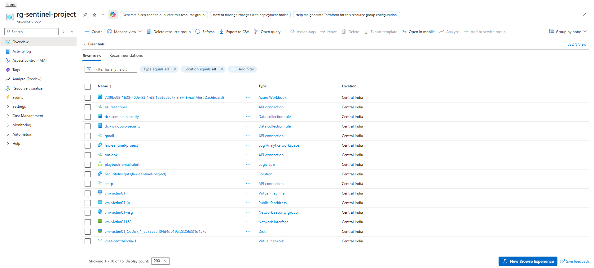 |
| Log Analytics workspace | 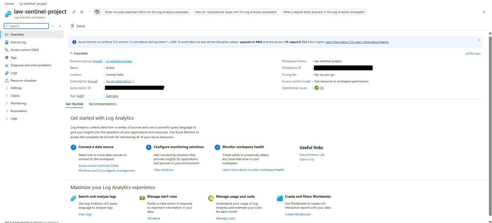 |
| Analytics rules | 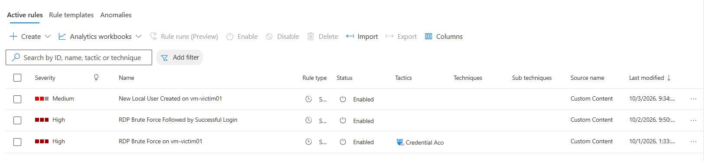 |
| Automation rule | 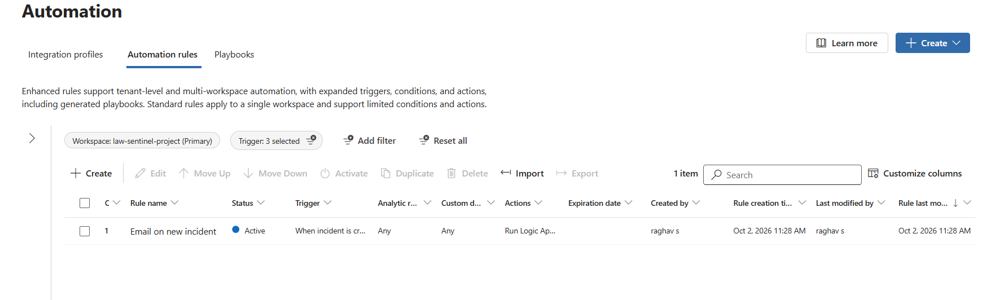 |
| Playbook designer | 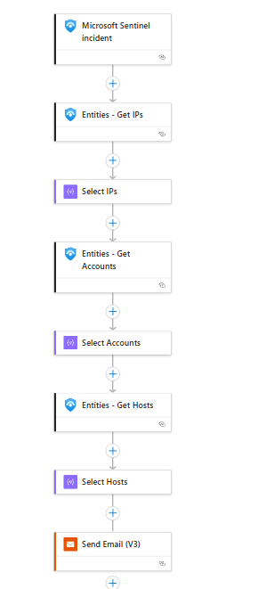 |
| Incidents | 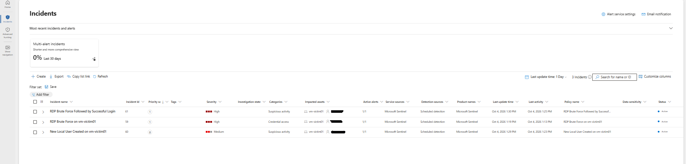 |
| Alert email | 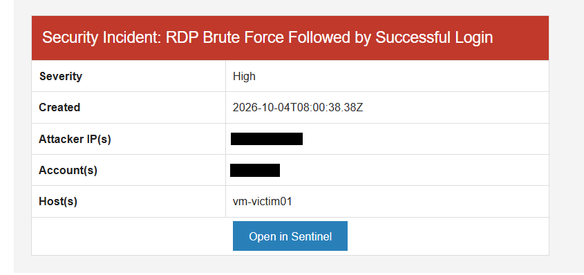 |
| Workbook (tiles 1 and 2) | 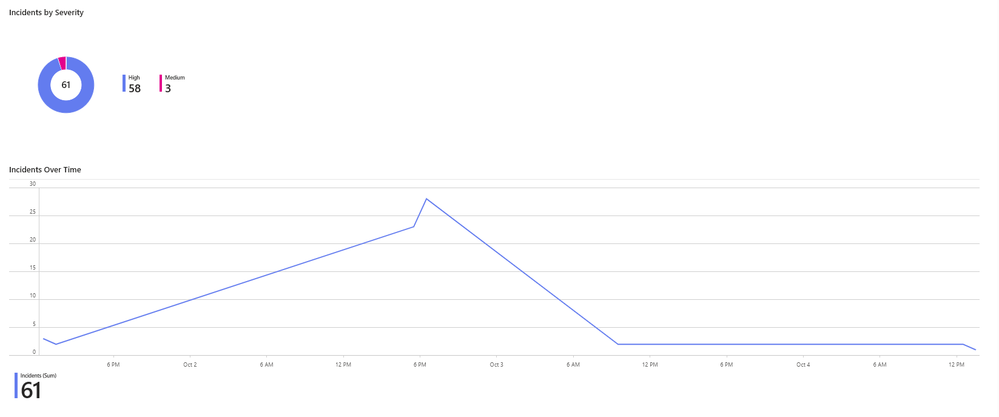 |
| Workbook (tiles 3 and 4) | 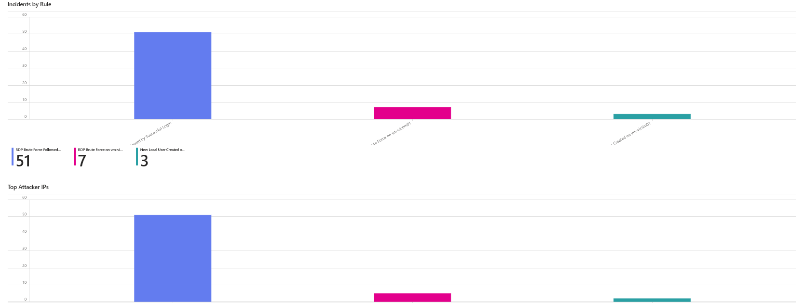 |
| Logic App runs | 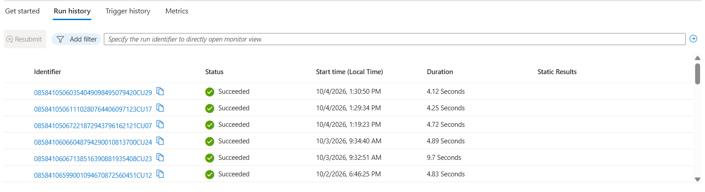 |
| Failed logins in the logs | 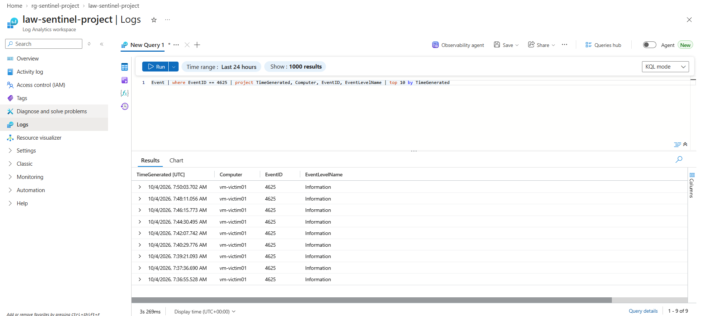 |
| RDP network rule | 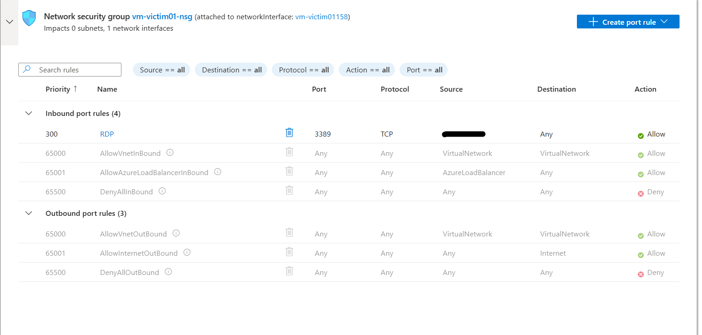 |

Private values (subscription ID, workspace ID, IP addresses, account names, email address) were removed from every image. The IP labels of the "Top attacker IPs" tile were cropped out.

## Repository layout

```
queries/       KQL for the three analytics rules and the workbook tiles
playbook/      Logic App export (playbook-email-alert.json) and a short note
screenshots/   Evidence of the lab, the incidents, the email and the dashboard
docs/          Thesis (public copy with private values removed)
```

## How to reproduce

1. Create a resource group, a Log Analytics workspace and a Windows VM in Azure. Turn on Microsoft Sentinel for the workspace.
2. Connect the VM with the Azure Monitor Agent and a data collection rule that collects Security events 4624, 4625 and 4720.
3. Create three scheduled analytics rules from the files in `queries/`.
4. Import `playbook/playbook-email-alert.json` into a new Logic App. Replace the placeholders `<SUBSCRIPTION_ID>` and `<YOUR_EMAIL>` with your own values, then re-authorize the Sentinel and email connections.
5. Create an automation rule that runs the playbook when an incident is created.
6. Create the workbook with the queries in `queries/dashboard_queries.kql`.
7. Test from another computer: enter 5 or more wrong RDP passwords, log in correctly, then run `net user demouser1 <password> /add` on the VM.

## Notes and limitations

- Rules 1 and 2 read the `Event` table (raw XML, parsed with `parse_xml`). Rule 3 reads `SecurityEvent`, which has ready-made columns. Which table receives the data depends on the data collection rule that collects each log.
- The field positions `Data[19]`, `Data[18]`, `Data[5]` and `Data[8]` were checked on Windows Server 2025 logs. They can differ on other systems.
- Detection delay depends on the agent upload time and the 5-minute rule schedule.
- This is a single-VM lab, and each use case was run a small number of times, so the timings are not averages.
- The lab VM was stopped after the demo to avoid cost. Do not open RDP to the internet outside a lab.
